# Hum AI — domain-aware multimodal affective modeling platform

**Hum AI** is a local-first, personalized, multimodal voice biomarker and affective modeling platform built around a single standardized **12-second hum**. The hum is the primary input. Public datasets supply **cold-start priors only**; as a user accumulates eligible hums, native Hum AI data and a personal rolling baseline progressively dominate the model. Hum AI surfaces emotional-state signals, anxiety- and depressive-affect **risk markers**, stress load, recovery/worsening trends, and relapse-risk drift — as reflective, within-user signals, never as a diagnosis. Hum AI is **non-clinical and not clinically validated**.

> **Naming:** The product is **Hum AI**. The machine-safe slug is **hum-ai**. The package scope is **@hum-ai**. References to the older technical specification use **legacy Hum** explicitly. See [ADR-0000](docs/adr/0000-product-naming.md).

## The problem and why a hum

Voice carries affect- and mental-state information: systematic reviews report that prosodic, spectral, and perturbation features (F0, jitter, shimmer, HNR, MFCC, spectral tilt) distinguish depression from controls at AUC 0.71–0.93 [clinical_voice_biomarker_review]. But that evidence is fragile — 6 of 12 studies carried high methodological-bias risk and generalizability is unproven — so clinical-speech findings are treated strictly as a **prior**, never as ground truth for a hum [clinical_voice_biomarker_review].

A free-speech sample is confounded by language, content, and privacy exposure. A **sustained, sung/melodic vocalization** strips most of that away: the same acoustic biomarkers are **language-independent and highly transferable**, and singing/simple melodic structures are a validated vocal-biomarker source that engages both assessment and intervention pathways [vocal_biomarker_and_singing_protocol_support]. The standardized 12-second hum is the practical realization of that idea — a fixed, content-free, comparable-across-sessions signal that is the closest public-data bridge to native hum data [vocal_biomarker_and_singing_protocol_support].

## Architecture at a glance

The read **leads with a valence + arousal axis read, available from the first hum** ([ADR-0010](docs/adr/0010-model-led-read-from-first-hum.md)). The backbone is the transparent, on-domain **acoustic axes** (energy/brightness/pitch/clarity/stability → valence/arousal). Trained **far-domain priors refine that read silently**: each carries an OOD distance and **abstains when the hum is outside its acted-speech domain** (the common case), nudging the acoustic value only when in-domain (weight capped at 0.5 — it never overrides). A secondary 6-way affect-label hint rides alongside but is no longer the dimensional read.

**The product grows past the far-domain ceiling via a human-in-the-loop** ([ADR-0011](docs/adr/0011-hitl-native-hum-retraining-loop.md)). After a read the user confirms or adjusts how they actually feel; each confirmation pairs the hum's derived features with a **benign valence/arousal self-report** — one row of native-hum truth. That single signal feeds two tracks: a **within-user axis calibration** that re-centres the read on this person immediately, and the **native-hum corpus** that a **browser-runnable retrain** fits a hum-native model on. A retrained model is promoted only when it **beats the transparent acoustic backbone on held-out hums** — and because its standardizer is fit on hums, it is **in-domain** and contributes with **no far-domain penalty** (the far-domain prior abstains; the user's own model does not). The corpus is the first real `native_hum` data ([dataset-registry](packages/dataset-registry/src/entries.ts) `native_hum_self_report_corpus`), stored derived-only and on-device.

Under that axis read sits expert-based **late fusion** with a deterministic reliability-weighted meta-learner over per-expert probability vectors, adapted from the TriSense FER+SER+TER design [trisense_architecture]. Hum's online path runs SER-family experts on the hum; FER/TER experts exist as optional, off-domain inputs.

**Models today (honest reconciliation):** the shipped browser priors are **trained-but-far-domain** classical JSON models (RAVDESS acted speech, penalized as priors, never hum truth — [ADR-0005](docs/adr/0005-public-datasets-as-priors-not-truth.md)): the 6-class `model.json` and the `model.valence_binary.json` are **below the experimental ~80% gate** (valence "developing"), while `model.arousal_binary.json` **cleared the gate at ~83%** — surfaced as an auxiliary prior that does **not** steer the affect/intervention read. The newer **mel-CNN hum model (~84.2% arousal on hum)** is a **Python-CLI-only research checkpoint** — not browser-servable and **not promoted** (below its own 85% gate). The `LogisticRegressionMetaLearner` remains the drop-in target once weights are fit on native hum data; its `combine` throws until then.

```mermaid
flowchart LR
  A[Capture 12s hum<br/>raw-ish constraints] --> B[audio-features<br/>AcousticFeatures + CaptureMetrics]
  B --> C[quality-gate<br/>clean/borderline/rejected<br/>+ capture cap]
  C --> D[domain-classifier<br/>HeuristicDomainClassifier<br/>+ HumDomainAdapter]
  D --> E[experts<br/>SER ensemble +/- FER/TER]
  E --> F[fusion-engine<br/>reliability-weighted meta-learner<br/>calibrated, capped confidence]
  F --> G[personalization-engine<br/>rolling baseline, z-deltas, stage cap]
  G --> H[relapse-engine<br/>within-user paired comparison]
  H --> I[intervention-engine<br/>VA-mapped suggestion]
  I --> J[safety-language<br/>non-diagnostic render]
```



Confidence is **capped, not just calibrated**. The strictest of the capture-quality cap (`CAPTURE_QUALITY_CONFIDENCE_CAP`), the domain-gap penalty (`domainGapPenalty`), and the personalization-stage cap wins via `combineCaps`. Stage caps rise only as the model earns confidence: **0.72** (first hum) → **0.76** (pre-baseline) → **0.82** (baseline, 5–9) → **0.88** (personalized, 10–19) → **0.92** (mature, 20+) [hum_spec]. Per [ADR-0010](docs/adr/0010-model-led-read-from-first-hum.md) the 5/10/20 thresholds are **silent progressive refinement, not a read gate**: the personal baseline and longitudinal model re-reference the axis read once they have history but no longer withhold it. Below the evidence floor the engine **abstains** with an explicit reason rather than guessing — a discipline reinforced by the under-exploration of dimensional valence–arousal and indirect SER use in the literature [ser_mental_health_review].

The relapse engine is a **within-user paired comparison** (`RelapseSample` vs reference), inspired by DVDSA's intra-patient recovery/worsening/unchanged design, not a group-level classifier [longitudinal_voice_treatment_response_source]. It emits `recovery | stable | worsening | relapse_drift | uncertain`, defaulting to `uncertain` when references are absent or conflicting.

## Monorepo layout

npm workspaces; one concern per package. All packages are `@hum-ai/*`.

| Package | Role |
| --- | --- |
| `shared-types` | Numeric/stats primitives (`clamp`, `percentile`, `computeRobustStats`, `zDelta`, `featureRatio`), branded ids, `MODALITIES`, domain taxonomy (`AUDIO_DOMAINS`, `domainGapPenalty`), `ValenceArousal`, consent + `FORBIDDEN_RAW_AUDIO_FIELDS`/`assertNoRawAudioFields`. |
| `affect-model-contracts` | Affect-head registry (`ALL_AFFECT_HEADS`, `RISK_MARKER_HEADS`), `MultiHeadAffectInference`, expert/confidence/intervention contracts, `ABSTAIN_REASONS`, `FUSION_LABELS`, `DVDSA_CLASSES`. |
| `dataset-registry` | `DatasetRegistryEntry`, `MODEL_USES`, `DOMAIN_FORBIDDEN_USES`, `validateEntry`/`isUseAllowed`, and the 7-entry source `REGISTRY`. |
| `audio-features` | `AcousticFeatures`, `CaptureMetrics`, primitives (`rms`, `peakAmplitude`, `silenceRatio`, `zeroCrossingRate`), and the real **`HumDspExtractor`/`computeFeatures`** — a deterministic, pure-TypeScript DSP pipeline (RMS framing, noise-floor/SNR proxy, autocorrelation pitch, local radix-2 FFT, voicing/expression proxies). `NotImplementedExtractor` retained. |
| `quality-gate` | `HUM_THRESHOLDS`, `CAPTURE_QUALITY_CONFIDENCE_CAP`, `evaluateQuality` → `QualityResult` (decision + capture quality + baseline eligibility). |
| `domain-classifier` | `HeuristicDomainClassifier`, `HumDomainAdapter.adaptPrior`/`.scoreCapture`, `HUM_COMPATIBILITY`. |
| `expert-ser` | Audio expert ensemble: `HumAcousticExpert`, `HumEmbeddingExpert`, `SingingPhonationExpert`, `VocalBurstExpressionExpert`, `SpeechEmotionExpert`, `SpeechClinicalExpert`, `defaultAudioExperts`. |
| `expert-fer` | `FaceEmotionExpert` (optional, off-domain). |
| `expert-ter` | `TextEmotionExpert` (optional, off-domain). |
| `fusion-engine` | `LogisticRegressionMetaLearner`, `ConfidenceModelV1`, `combineCaps`, `FusionEngine.fuse`, `expertWeight`, `modalityReliability`. |
| `personalization-engine` | `PERSONALIZATION_STAGES`/`stagePolicy`, `UserModelProfile`, `buildBaselineVector`, `zDeltasAgainstBaseline`, `newUserProfile`. |
| `relapse-engine` | `RelapseSample`, `RELAPSE_CLASSES`, `classifyComparison`, `assessRelapse` → `RelapseVerdict`. |
| `intervention-engine` | `selectIntervention`, `InterventionContext` → `InterventionSuggestion`. |
| `safety-language` | `FORBIDDEN_PHRASES`, `validateUserFacingText`, `assertSafeUserFacingText`, `INTERNAL_TO_USER_FACING`, `userFacingLabel`. |
| `orchestrator` | End-to-end read path: `orchestrateHumRead`/`orchestrateHumAudio` — two-head split + consent gate, dual baseline, qualitative confidence, raw-audio/clinical-leak guards on the sync payload. Plus the **HiTL feedback seam** (`buildFeedbackRequest` active-learning, `applyFeedback`) and personal axis-calibration in the read. |
| `native-corpus` | The **human-in-the-loop retraining loop** ([ADR-0011](docs/adr/0011-hitl-native-hum-retraining-loop.md)): the on-device `NativeCorpus` of `{derived features, benign self-report}` rows, read-calibration/ECE tracking, active-learning readiness, a **browser-runnable** retrain→gate→promote (reuses signal-lab's `trainLogReg`), and the in-domain hum-native `AffectAxisPrior` wrapper. Pure TS; no raw audio ever stored. |
| `qa-gates` | The `npm run qa` gates: `no-clinical-leak`, `no-camera-deps`, `no-raw-confidence-copy`, `forbidden-files`. |
| `dataset-harness` | Local-only dataset manifest/validate CLI (`data:manifest`, `data:validate`); no audio ever written into the repo. |
| `naming-check` | Enforces the Hum AI / `@hum-ai` naming constitution (ADR-0000). |

Plus **`apps/`** — **`web`** is a real **local-first Vite SPA** that runs the full spine **client-side** (capture → Stage ① acceptance gate → axis read → personalization → longitudinal), persists to localStorage / Firebase, and is **deployed to Vercel production** (`vercel.json` `build:web` → `apps/web/dist`; `firebase.json` + `firestore.rules` deployed to `humai-core-prod`); `mobile`/`ops` remain placeholder shells. Plus **`research/`** (Python dataset/training/evaluation/model-card work; see the models line below for what is trained vs. shipped).

## Quickstart

Requires **Node ≥ 22.6** (uses the built-in test runner with `--import`).

```bash
npm install        # workspaces, dev-deps only (tsx, typescript, @types/node)
npm test           # node --import tsx --test "packages/**/test/**/*.test.ts"
npm run typecheck  # tsc --noEmit -p tsconfig.json
npm run check      # typecheck + test
npm run qa         # QA gates: clinical-leak, camera-deps, confidence-copy, forbidden-files
npm run demo:voice # drives synthetic hums through the full pipeline (no mic, no camera)
```

Tests run **TypeScript directly** via `tsx` + the **Node built-in test runner** (`node:test`/`node:assert`) — there is **no third-party test framework dependency**.

## Test coverage map

The 10 required test areas and where each is covered:

| # | Test area | Covered by |
| --- | --- | --- |
| 1 | Numeric/stats + privacy guard | `shared-types/test/numeric.test.ts`, `privacy.test.ts` |
| 2 | Affect-head contracts + abstention/risk flags | `affect-model-contracts/test/contracts.test.ts` |
| 3 | Dataset governance (forbidden uses) | `dataset-registry/test/rules.test.ts` |
| 4 | Quality gate (reject/cap/baseline eligibility) | `quality-gate/test/gate.test.ts` |
| 5 | Domain classification + hum adaptation/penalty | `domain-classifier/test/domain.test.ts` |
| 6 | SER expert ensemble behavior | `expert-ser/test/experts.test.ts` (FER `expert-fer/test`, TER `expert-ter/test`) |
| 7 | Late fusion + capped/calibrated confidence | `fusion-engine/test/fuse.test.ts`, `confidence.test.ts` |
| 8 | Personalization ladder + rolling baseline | `personalization-engine/test/personalization.test.ts` |
| 9 | Within-user relapse/recovery comparison | `relapse-engine/test/relapse.test.ts` |
| 10 | Safety language + intervention rationale | `safety-language/test/safety.test.ts`, `intervention-engine/test/intervention.test.ts` |

## Status & non-claims

- **Voice core is real; experts are still stubs.** The hum feature extractor (`@hum-ai/audio-features` `HumDspExtractor`/`computeFeatures`) and the `orchestrateHumAudio(buffer)` audio entry point are implemented and tested as **deterministic, dependency-free DSP — honest signal processing, not a trained or clinically validated model**. The downstream affect/embedding experts remain **heuristic stubs** (`HeuristicDomainClassifier`, stub-weighted/seeded experts); the SER/embedding models (WavLM/HuBERT/Wav2Vec2) are Phase-2 work behind the `AffectExpert` contract. **Some classical priors are trained** — the browser serves far-domain RAVDESS LogReg/RF JSON priors (`model.arousal_binary.json` cleared the ~80% experimental gate at ~83%; the 6-class and valence priors are below-gate), kept as penalized priors that never steer the affect/intervention read; a Python-CLI-only **mel-CNN hum model (~84.2% arousal)** is research-stage, not browser-served and **not promoted** (below its 85% gate). See the [voice-first roadmap](docs/architecture/VOICE_FIRST_ROADMAP.md) and [ADR-0010](docs/adr/0010-model-led-read-from-first-hum.md).
- **Non-clinical, not validated.** Hum is **not** a medical device, **not** FDA-cleared, and **not** clinically validated. It produces risk **markers** and reflective signals, never a diagnosis.
- **Reference numbers are not Hum metrics.** TriSense MELD stream/fusion accuracies (18.4 / 38.0 / 54.0 → 66.0%) are **architecture-reference numbers on TV dialogue** [trisense_architecture]; clinical AUC/accuracy ranges are study priors [clinical_voice_biomarker_review; longitudinal_voice_treatment_response_source]. None are presented as Hum's accuracy. No fabricated metrics anywhere.
- **Privacy posture.** Local-first; raw audio is not uploaded by default; only derived data syncs, and every sync payload must pass `assertNoRawAudioFields` [hum_spec].

## Documentation index

- **Architecture & tech spec (latest):** [docs/ARCHITECTURE.md](docs/ARCHITECTURE.md) · **All-layers revamp plan:** [docs/REVAMP_PLAN.md](docs/REVAMP_PLAN.md)
- Source manifest & provenance: [docs/source/INDEX.md](docs/source/INDEX.md) (source binaries are local-only — see [docs/source/README.md](docs/source/README.md))
- Architecture: [docs/architecture/](docs/architecture/) (pipeline, fusion, personalization, relapse, [voice-first roadmap](docs/architecture/VOICE_FIRST_ROADMAP.md))
- Claims ladder & non-claims: [docs/claims/CLAIMS_LADDER.md](docs/claims/CLAIMS_LADDER.md)
- Validation & evaluation protocol: [docs/validation/](docs/validation/), [research/evaluation/](research/evaluation/README.md)
- Privacy & data governance: [docs/privacy/DATA_GOVERNANCE.md](docs/privacy/DATA_GOVERNANCE.md), [public-repo privacy checklist](docs/privacy/PUBLIC_REPO_PRIVACY_CHECKLIST.md)
- Decision records: [docs/adr/](docs/adr/) — naming (0000), spine (0001), audio (0002), personalization/relapse (0003), confidence (0004), datasets-as-priors (0005), **two-head separation (0006)**, **dual baseline (0007)**, **user-facing confidence (0008)**, **voice-first/camera-later (0009)**, **model-led axis read from hum #1 (0010)**
- DevOps & deployment: [docs/devops/](docs/devops/) (GitHub bootstrap, branch protection, Vercel setup, deployment, environment variables)
- Research scaffolds & model cards: [research/README.md](research/README.md), [research/model-cards/](research/model-cards/)

## Next steps

1. Replace heuristic experts with trained SER/embedding models; register every dataset in `dataset-registry` before use [ser_mental_health_review].
2. **In progress — the native-hum loop ships ([ADR-0011](docs/adr/0011-hitl-native-hum-retraining-loop.md)).** A human-in-the-loop now grows the `native_hum` corpus on-device and retrains a hum-native axis model that beats the acoustic backbone before it steers the read. Next: pool the (consented, derived-only) corpus into a governed backend, raise the promotion gate toward the rigorous 0.80 / p<.01 / ECE bar as `n` grows, and fit/calibrate the `LogisticRegressionMetaLearner` on the accumulated hum data.
3. Stand up within-user DVDSA-style longitudinal evaluation for the relapse engine [longitudinal_voice_treatment_response_source].
4. Ground intervention suggestions in the music-stress evidence base as **support, not diagnosis** [intervention_support_source].
5. **Done — the browser capture surface ships.** `apps/web` is a deployed local-first SPA: `getUserMedia({ audio })` (no camera) feeds the full client-side spine — Stage ① acceptance gate → axis read → personalization → longitudinal — with the classical JSON priors served from `apps/web/public/models/` (ADR-0006/0007/0008/0009/0010). Next: port the mel-CNN to a browser-runnable form (mel filterbank + conv1d) or stand up a hum-native dataset so a genuinely model-led read can be served, not just refined.
